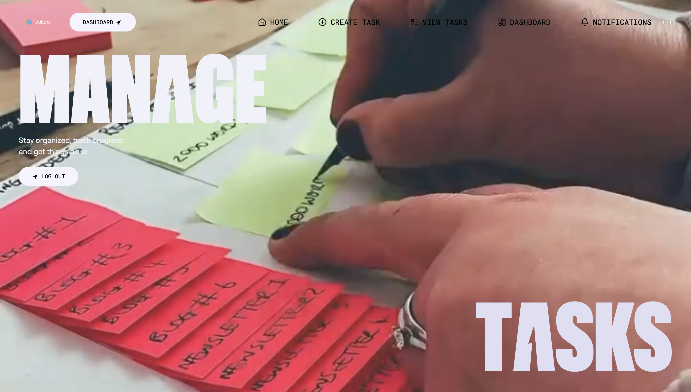
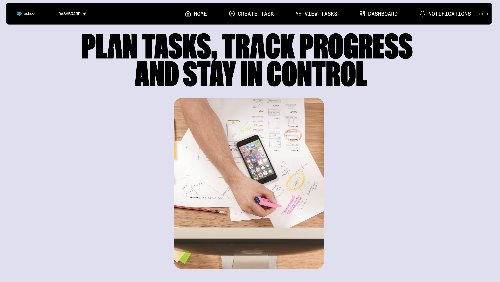
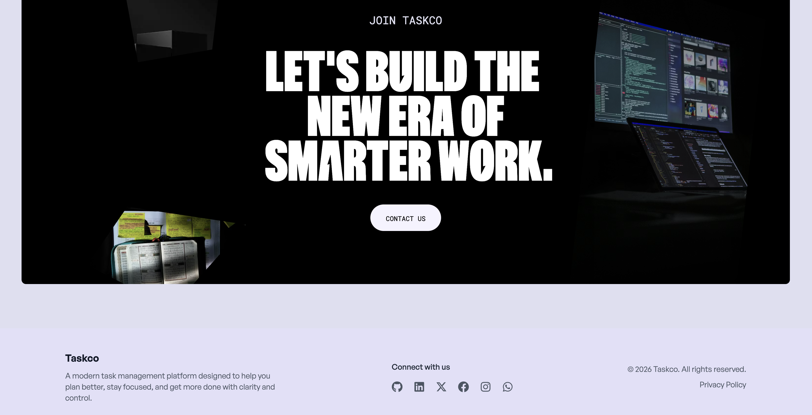

# Taskco Frontend

<div align="center">


A modern, responsive, and feature-rich task management application built with React, featuring beautiful animations, intuitive UI, and seamless user experience.

[Live Demo](#) | [Backend API](../backend/README.md) | [Report Bug](https://github.com/Aditya-KumarJha/Taskco/issues)

</div>

---

## 📋 Table of Contents

- [Features](#-features)
- [Demo Screenshots](#-demo-screenshots)
- [Tech Stack](#-tech-stack)
- [Project Structure](#-project-structure)
- [Prerequisites](#-prerequisites)
- [Installation](#-installation)
- [Environment Variables](#-environment-variables)
- [Running the Application](#-running-the-application)
- [Build & Deployment](#-build--deployment)
- [Features in Detail](#-features-in-detail)
- [Component Architecture](#-component-architecture)
- [State Management](#-state-management)
- [Animations & Effects](#-animations--effects)
- [Scripts](#-scripts)

---

## ✨ Features

### 🎨 **Beautiful UI/UX**
- Modern, clean, and intuitive interface
- Responsive design for all devices (mobile, tablet, desktop)
- Smooth animations and transitions using GSAP & Framer Motion
- Lottie animations for enhanced visual appeal
- Dark mode support (coming soon)

### 🔐 **Authentication**
- Email & Password authentication with OTP verification
- Google OAuth integration
- GitHub OAuth integration
- Secure password reset flow
- Persistent login sessions
- Protected routes

### ✅ **Task Management**
- Create, read, update, and delete tasks
- Task categories (Work, Personal, Shopping, Health, Other)
- Priority levels (Low, Medium, High)
- Task status tracking (Pending, In Progress, Completed)
- Due date management with calendar picker
- Image attachments for tasks
- Search and filter tasks
- Task statistics dashboard

### 🔔 **Notifications**
- Real-time notification system
- Task assignment notifications
- Task update alerts
- Mark as read functionality
- Notification badge counter
- Delete notifications

### 👤 **Profile Management**
- View and edit user profile
- Upload profile avatar
- Update personal information
- View account statistics

### 🎭 **Landing Page**
- Engaging hero section with animations
- Feature showcase
- About section
- Contact form
- Responsive navigation
- Smooth scrolling

---

## 📸 Demo Screenshots

### Homepage

*Modern landing page with smooth animations and engaging hero section*

### Dashboard

*Intuitive task management interface with filtering and statistics*

### Task Management

*Easy task creation with categories, priorities, and image uploads*

---

## 🛠️ Tech Stack

| Technology | Purpose | Version |
|-----------|---------|---------|
| **React** | UI Library | 18.3.1 |
| **Vite** | Build Tool & Dev Server | 5.4.10 |
| **React Router** | Client-side Routing | 6.14.1 |
| **Redux Toolkit** | State Management | 2.2.1 |
| **TailwindCSS** | Utility-first CSS | 3.4.14 |
| **GSAP** | Advanced Animations | 3.12.5 |
| **Framer Motion** | React Animations | 12.31.0 |
| **Lottie React** | JSON Animations | 2.4.1 |
| **React Icons** | Icon Library | 5.3.0 |
| **Lucide React** | Modern Icons | 0.263.1 |
| **React Toastify** | Toast Notifications | 10.0.4 |
| **date-fns** | Date Formatting | 4.1.0 |
| **Axios** | HTTP Client | (via utils/api.js) |
| **clsx** | Conditional Classes | 2.1.1 |

---

## 📁 Project Structure

```
frontend/
├── public/
│   ├── audio/               # Sound effects and audio files
│   ├── fonts/               # Custom font files
│   ├── img/
│   │   ├── about.avif      # About section image
│   │   ├── desk.avif       # Desk workspace image
│   │   ├── entrance.avif   # Entrance/hero image
│   │   ├── notebook.avif   # Notebook image
│   │   └── demo/           # Demo screenshots
│   │       ├── demo-1.png  # Homepage screenshot
│   │       ├── demo-2.png  # Dashboard screenshot
│   │       └── demo-3.png  # Task management screenshot
│   └── videos/             # Video assets
│
├── src/
│   ├── assets/             # Static assets (images, icons)
│   │
│   ├── components/
│   │   ├── About.jsx       # About section component
│   │   ├── Contact.jsx     # Contact form component
│   │   ├── Features.jsx    # Features showcase
│   │   ├── Footer.jsx      # Footer component
│   │   ├── Hero.jsx        # Hero section
│   │   ├── Navbar.jsx      # Navigation bar
│   │   ├── Story.jsx       # Story section
│   │   │
│   │   ├── animations/     # Animation components
│   │   │   └── (Lottie, GSAP wrappers)
│   │   │
│   │   ├── auth/           # Authentication components
│   │   │   ├── LoginForm.jsx
│   │   │   ├── SignupForm.jsx
│   │   │   ├── OTPVerification.jsx
│   │   │   ├── ForgotPassword.jsx
│   │   │   └── SocialAuth.jsx
│   │   │
│   │   ├── dashboard/      # Dashboard components
│   │   │   ├── DashboardHeader.jsx
│   │   │   ├── StatCard.jsx
│   │   │   ├── QuickActions.jsx
│   │   │   └── RecentTasks.jsx
│   │   │
│   │   ├── notifications/  # Notification components
│   │   │   ├── NotificationList.jsx
│   │   │   ├── NotificationItem.jsx
│   │   │   └── NotificationBadge.jsx
│   │   │
│   │   ├── tasks/          # Task components
│   │   │   ├── TaskCard.jsx
│   │   │   ├── TaskList.jsx
│   │   │   ├── TaskForm.jsx
│   │   │   ├── TaskFilters.jsx
│   │   │   ├── TaskModal.jsx
│   │   │   └── TaskStats.jsx
│   │   │
│   │   └── ui/             # Reusable UI components
│   │       ├── Button.jsx
│   │       ├── Input.jsx
│   │       ├── Modal.jsx
│   │       ├── Card.jsx
│   │       ├── Badge.jsx
│   │       ├── Spinner.jsx
│   │       └── Dropdown.jsx
│   │
│   ├── lottie/             # Lottie animation JSON files
│   │   ├── animation-1.json
│   │   ├── animation-2.json
│   │   └── animation-3.json
│   │
│   ├── pages/              # Page components (routes)
│   │   ├── Home.jsx        # Landing page
│   │   ├── LoginPage.jsx   # Login page
│   │   ├── SignupPage.jsx  # Registration page
│   │   ├── Dashboard.jsx   # Main dashboard
│   │   ├── TaskPage.jsx    # Task listing page
│   │   ├── CreateTaskPage.jsx # Task creation page
│   │   └── NotificationPage.jsx # Notifications page
│   │
│   ├── store/              # Redux state management
│   │   ├── store.js        # Redux store configuration
│   │   ├── authSlice.js    # Authentication state
│   │   ├── taskSlice.js    # Tasks state
│   │   └── notificationSlice.js # Notifications state
│   │
│   ├── utils/
│   │   └── api.js          # Axios configuration & API calls
│   │
│   ├── App.jsx             # Main App component with routing
│   ├── main.jsx            # Application entry point
│   └── index.css           # Global styles & Tailwind imports
│
├── index.html              # HTML template
├── package.json            # Dependencies
├── vite.config.js          # Vite configuration
├── tailwind.config.js      # Tailwind CSS configuration
├── postcss.config.js       # PostCSS configuration
└── README.md               # This file
```

---

## 📋 Prerequisites

Before you begin, ensure you have the following installed:

- **Node.js** (v18.0.0 or higher)
- **npm** or **yarn**
- **Backend API** running (see [Backend README](../backend/README.md))

---

## 🚀 Installation

### 1. Clone the repository

```bash
git clone https://github.com/Aditya-KumarJha/Taskco.git
cd Taskco/frontend
```

### 2. Install dependencies

```bash
npm install
```

### 3. Set up environment variables

Create a `.env` file in the frontend directory:

```bash
cp .env.example .env
```

Edit the `.env` file with your configuration.

---

## 🔐 Environment Variables

Create a `.env` file with the following variables:

```env
# API Configuration
VITE_API_URL=http://localhost:3000/api
VITE_API_TIMEOUT=10000

# OAuth Redirect URLs (must match backend configuration)
VITE_GOOGLE_REDIRECT_URI=http://localhost:3000/api/auth/google
VITE_GITHUB_REDIRECT_URI=http://localhost:3000/api/auth/github

# Feature Flags (optional)
VITE_ENABLE_NOTIFICATIONS=true
VITE_ENABLE_ANALYTICS=false

# App Configuration
VITE_APP_NAME=Taskco
VITE_APP_VERSION=1.0.0
```

### Environment Variables Explanation

| Variable | Description | Default |
|----------|-------------|---------|
| `VITE_API_URL` | Backend API base URL | `http://localhost:3000/api` |
| `VITE_API_TIMEOUT` | API request timeout (ms) | `10000` |
| `VITE_GOOGLE_REDIRECT_URI` | Google OAuth redirect | Backend Google OAuth URL |
| `VITE_GITHUB_REDIRECT_URI` | GitHub OAuth redirect | Backend GitHub OAuth URL |
| `VITE_ENABLE_NOTIFICATIONS` | Enable notifications feature | `true` |
| `VITE_ENABLE_ANALYTICS` | Enable analytics tracking | `false` |

---

## 🏃 Running the Application

### Development Mode

Start the development server with hot reload:

```bash
npm run dev
```

The application will start on `http://localhost:5173`

**Features in Dev Mode:**
- ⚡ Hot Module Replacement (HMR)
- 🔍 React Fast Refresh
- 📝 Source maps for debugging
- 🎨 CSS hot reload

### Preview Production Build

Build and preview the production version locally:

```bash
npm run build
npm run preview
```

---

## 🏗️ Build & Deployment

### Build for Production

```bash
npm run build
```

This creates an optimized production build in the `dist/` folder.

**Build Optimizations:**
- Code splitting
- Tree shaking
- Minification
- Asset optimization
- Gzip compression

### Deploy to Vercel

```bash
npm install -g vercel
vercel --prod
```

### Deploy to Netlify

```bash
npm install -g netlify-cli
netlify deploy --prod --dir=dist
```

### Deploy to GitHub Pages

```bash
# Add to package.json:
# "homepage": "https://yourusername.github.io/Taskco"

npm run build
git add dist -f
git commit -m "Deploy to GitHub Pages"
git subtree push --prefix dist origin gh-pages
```

### Environment Variables for Production

Ensure you set these in your hosting provider:

- `VITE_API_URL`: Your production backend URL
- `VITE_GOOGLE_REDIRECT_URI`: Production Google OAuth URL
- `VITE_GITHUB_REDIRECT_URI`: Production GitHub OAuth URL

---

## 🎯 Features in Detail

### Authentication System

**Login Flow:**
1. User enters email and password
2. Backend sends OTP to email
3. User verifies OTP
4. JWT token stored in cookies
5. Auto-redirect to dashboard

**OAuth Flow:**
1. User clicks "Login with Google/GitHub"
2. Redirects to provider authentication
3. Provider callback to backend
4. Token issued and stored
5. Redirect to dashboard

**Protected Routes:**
- Dashboard
- Task Management
- Profile
- Notifications

### Task Management Features

**Create Task:**
- Title (required)
- Description
- Category selection
- Priority level
- Due date picker
- Image upload (optional)

**Task Filters:**
- Status: All, Pending, In Progress, Completed
- Priority: All, Low, Medium, High
- Category: Work, Personal, Shopping, Health, Other
- Search by title/description
- Sort by: Created date, Due date, Priority

**Task Statistics:**
- Total tasks count
- Completed tasks
- Pending tasks
- Overdue tasks
- Completion rate chart

### Notification System

**Notification Types:**
- Task assigned to you
- Task status changed
- Task due date approaching
- Task mentioned you
- System notifications

**Features:**
- Real-time updates
- Unread badge counter
- Mark as read
- Delete notifications
- Notification sound (optional)

### Profile Management

**Profile Features:**
- View profile information
- Edit full name
- Update bio
- Upload/change avatar
- View account statistics
- Account creation date

---

## 🧩 Component Architecture

### Page Components

| Page | Route | Description |
|------|-------|-------------|
| `Home` | `/` | Landing page with hero, features, about |
| `LoginPage` | `/login` | User login with email/OAuth |
| `SignupPage` | `/signup` | New user registration |
| `Dashboard` | `/dashboard` | Main dashboard with stats |
| `TaskPage` | `/tasks` | Task list with filters |
| `CreateTaskPage` | `/tasks/create` | Create new task form |
| `NotificationPage` | `/notifications` | Notification center |

### Reusable Components

**UI Components:**
- `Button`: Customizable button with variants
- `Input`: Form input with validation
- `Modal`: Reusable modal dialog
- `Card`: Container component
- `Badge`: Status/count badge
- `Spinner`: Loading indicator

**Task Components:**
- `TaskCard`: Individual task display
- `TaskList`: List of tasks with pagination
- `TaskForm`: Create/edit task form
- `TaskFilters`: Filter controls
- `TaskModal`: Task details modal
- `TaskStats`: Statistics dashboard

**Auth Components:**
- `LoginForm`: Email/password login
- `SignupForm`: Registration form
- `OTPVerification`: OTP input
- `SocialAuth`: OAuth buttons

**Notification Components:**
- `NotificationList`: All notifications
- `NotificationItem`: Single notification
- `NotificationBadge`: Unread counter

---

## 🔄 State Management

### Redux Slices

#### Auth Slice (`authSlice.js`)

**State:**
```javascript
{
  user: null,           // Current user object
  isAuthenticated: false,
  loading: false,
  error: null,
  token: null
}
```

**Actions:**
- `login`: Authenticate user
- `logout`: Clear user session
- `register`: Create new account
- `updateProfile`: Update user info
- `verifyOTP`: Verify email OTP

#### Task Slice (`taskSlice.js`)

**State:**
```javascript
{
  tasks: [],           // All tasks
  currentTask: null,   // Selected task
  filters: {},         // Active filters
  stats: {},           // Task statistics
  loading: false,
  error: null
}
```

**Actions:**
- `fetchTasks`: Get all tasks
- `createTask`: Add new task
- `updateTask`: Edit existing task
- `deleteTask`: Remove task
- `setFilters`: Update active filters
- `fetchStats`: Get task statistics

#### Notification Slice (`notificationSlice.js`)

**State:**
```javascript
{
  notifications: [],   // All notifications
  unreadCount: 0,      // Unread count
  loading: false,
  error: null
}
```

**Actions:**
- `fetchNotifications`: Get all notifications
- `markAsRead`: Mark notification read
- `markAllAsRead`: Mark all as read
- `deleteNotification`: Remove notification

---

## 🎨 Animations & Effects

### GSAP Animations

**Used for:**
- Hero section text reveal
- Scroll-triggered animations
- Parallax effects
- Image reveals
- Feature cards entrance

**Example:**
```javascript
import { gsap } from 'gsap';
import { ScrollTrigger } from 'gsap/ScrollTrigger';

gsap.registerPlugin(ScrollTrigger);

gsap.to('.hero-title', {
  opacity: 1,
  y: 0,
  duration: 1.2,
  ease: 'power3.out'
});
```

### Framer Motion

**Used for:**
- Page transitions
- Modal animations
- Button hover effects
- List item animations
- Card hover effects

**Example:**
```javascript
import { motion } from 'framer-motion';

<motion.div
  initial={{ opacity: 0, y: 20 }}
  animate={{ opacity: 1, y: 0 }}
  exit={{ opacity: 0, y: -20 }}
  transition={{ duration: 0.3 }}
>
  Content
</motion.div>
```

### Lottie Animations

**Used for:**
- Loading states
- Empty states
- Success confirmations
- Error messages
- Feature illustrations

**Files:**
- `animation-1.json`: Task completion
- `animation-2.json`: Loading spinner
- `animation-3.json`: Empty state

---

## 📜 Scripts

Complete guide to all available npm scripts for the frontend application.

### Quick Reference

| Command | Description | Usage | Port |
|---------|-------------|-------|------|
| `npm run dev` | Start development server | Local development | 5173 |
| `npm run build` | Build for production | Production deployment | - |
| `npm run preview` | Preview production build | Testing build locally | 4173 |
| `npm run lint` | Run ESLint | Code quality check | - |

---

### Development Scripts

#### `npm run dev`

**Start Vite development server with hot reload**

```bash
npm run dev
```

**What it does:**
- Starts **Vite** development server
- Enables **Hot Module Replacement (HMR)**
- Opens application at `http://localhost:5173`
- Watches for file changes and auto-reloads
- Enables React Fast Refresh
- Serves with source maps for debugging

**Features:**
- ⚡ Lightning-fast HMR (< 100ms updates)
- 🔥 React Fast Refresh (preserves state)
- 🎨 CSS hot reload (no page refresh)
- 🖼️ Image optimization on-the-fly
- 🐛 Detailed error overlay
- 📝 Source maps for debugging

**Output:**
```
  VITE v5.4.10  ready in 523 ms

  ➜  Local:   http://localhost:5173/
  ➜  Network: http://192.168.1.100:5173/
  ➜  press h + enter to show help
```

**Common Issues:**
- Port 5173 already in use → Vite auto-increments to 5174
- Module not found → Run `npm install`
- Blank page → Check browser console for errors

---

### Build Scripts

#### `npm run build`

**Create optimized production build**

```bash
npm run build
```

**What it does:**
- Compiles React code to optimized JavaScript
- Minifies all JavaScript and CSS
- Removes dead code (tree shaking)
- Splits code into chunks (lazy loading)
- Optimizes images and assets
- Generates production-ready `/dist` folder

**Build Optimizations:**
- 📦 **Code Splitting** - Separate chunks for better caching
- 🌳 **Tree Shaking** - Removes unused exports
- 🗜️ **Minification** - Reduces file sizes (JS, CSS, HTML)
- 🖼️ **Image Optimization** - Compressed images
- 📊 **Bundle Analysis** - Generates size report
- 🔗 **Asset Hashing** - Cache busting with hashed filenames
- 📦 **Gzip Ready** - Pre-compressed for web servers

**Output:**
```
vite v5.4.10 building for production...
✓ 1234 modules transformed.
dist/index.html                   0.45 kB │ gzip:  0.30 kB
dist/assets/index-a1b2c3d4.css    45.2 kB │ gzip:  12.3 kB
dist/assets/index-e5f6g7h8.js    156.8 kB │ gzip:  52.1 kB
✓ built in 12.34s
```

**Build Output Structure:**
```
dist/
├── index.html              # Entry HTML file
├── assets/
│   ├── index.[hash].js    # Main JavaScript bundle
│   ├── index.[hash].css   # Compiled CSS
│   ├── vendor.[hash].js   # Third-party libraries
│   └── *.png/svg/jpg      # Optimized images
└── img/                   # Public images
```

**Typical Build Sizes:**
- Development: ~2-3 MB (uncompressed)
- Production: ~300-500 KB (gzipped)
- Initial Load: ~150-200 KB

**After Building:**
- Test locally: `npm run preview`
- Deploy `/dist` folder to hosting service
- Set environment variables on hosting platform

---

#### `npm run preview`

**Preview production build locally**

```bash
npm run preview
```

**What it does:**
- Serves the `/dist` folder locally
- Simulates production environment
- Tests build before actual deployment
- Runs on `http://localhost:4173`

**Prerequisites:**
- Must run `npm run build` first
- Requires `/dist` folder to exist

**Use Cases:**
- ✅ Verify build works correctly
- ✅ Test production optimizations
- ✅ Check routing in production mode
- ✅ Validate environment variables
- ✅ Ensure assets load correctly

**Output:**
```
  ➜  Local:   http://localhost:4173/
  ➜  Network: http://192.168.1.100:4173/
```

**Testing Checklist:**
- [ ] All pages load correctly
- [ ] Navigation works
- [ ] API calls succeed
- [ ] Images display properly
- [ ] Animations run smoothly
- [ ] No console errors
- [ ] Authentication works
- [ ] Forms submit correctly

---

### Code Quality Scripts

#### `npm run lint`

**Run ESLint to check code quality**

```bash
npm run lint
```

**What it does:**
- Runs **ESLint** on all source files
- Checks for syntax errors
- Enforces code style rules
- Identifies potential bugs
- Ensures React best practices
- Validates TailwindCSS usage

**Checks Include:**
- ✅ React best practices
- ✅ React Hooks rules
- ✅ JSX accessibility (a11y)
- ✅ Unused variables
- ✅ Missing dependencies
- ✅ TailwindCSS class order
- ✅ Import/export consistency

**Fix Automatically:**
```bash
npx eslint . --fix
```

**Common Warnings:**
- `react/prop-types` - Missing prop validation
- `react-hooks/exhaustive-deps` - Missing dependencies
- `no-unused-vars` - Unused variables
- `jsx-a11y/*` - Accessibility issues

---

### Advanced Workflows

#### 🚀 Development Workflow

```bash
# 1. Start development server
npm run dev

# 2. Make changes (auto-reloads)
# 3. Check for errors in browser console
# 4. Verify changes work as expected
```

#### 🏗️ Pre-Deployment Workflow

```bash
# 1. Check code quality
npm run lint

# 2. Build for production
npm run build

# 3. Preview build locally
npm run preview

# 4. Test all features
# 5. Deploy /dist folder
```

#### ✅ Pre-Commit Workflow

```bash
# 1. Lint code
npm run lint

# 2. Fix linting errors
npx eslint . --fix

# 3. Test build
npm run build

# 4. Commit if successful
git add .
git commit -m "Your message"
```

#### 🐛 Debugging Build Issues

```bash
# 1. Clear node_modules and cache
rm -rf node_modules dist .vite
npm install

# 2. Try building again
npm run build

# 3. Check for errors in output
# 4. Verify environment variables
# 5. Check browser console in preview
npm run preview
```

---

### Performance Tips

**Development:**
- Use `npm run dev` for fast iteration
- Enable React DevTools for debugging
- Check Network tab for slow requests
- Use Redux DevTools for state debugging

**Production:**
- Always run `npm run build` before deploying
- Test with `npm run preview` first
- Monitor bundle sizes (keep < 500KB gzipped)
- Enable gzip compression on server
- Use CDN for static assets

**Optimization:**
- Lazy load routes and components
- Optimize images before adding
- Use code splitting for large dependencies
- Minimize third-party libraries
- Enable tree shaking

---

### Troubleshooting

**Dev Server Won't Start:**
```bash
# Check if port is in use
lsof -ti:5173 | xargs kill -9

# Clear cache and restart
rm -rf node_modules/.vite
npm run dev
```

**Build Fails:**
```bash
# Clear everything and reinstall
rm -rf node_modules dist package-lock.json
npm install
npm run build
```

**Linting Errors:**
```bash
# Auto-fix what's possible
npx eslint . --fix

# Check remaining errors
npm run lint
```

**Environment Variables Not Working:**
- Ensure variables start with `VITE_`
- Restart dev server after changing `.env`
- Check `.env` file exists
- Verify variable names match in code

---

## 🎨 Styling

### TailwindCSS

**Utility Classes:**
- Responsive design: `sm:`, `md:`, `lg:`, `xl:`
- Flexbox: `flex`, `justify-center`, `items-center`
- Grid: `grid`, `grid-cols-3`, `gap-4`
- Colors: Custom palette in `tailwind.config.js`
- Spacing: Consistent margin/padding scale

**Custom Configuration:**
```javascript
// tailwind.config.js
module.exports = {
  theme: {
    extend: {
      colors: {
        primary: '#your-color',
        secondary: '#your-color',
      },
      fontFamily: {
        sans: ['Inter', 'sans-serif'],
      },
    },
  },
};
```

### Global Styles

**`index.css`:**
- Tailwind directives
- Custom CSS variables
- Global resets
- Font imports
- Animation keyframes

---

## 🔒 Security

- **XSS Protection**: React's built-in escaping
- **CSRF**: Backend CSRF tokens
- **Secure Cookies**: HTTPOnly cookies for tokens
- **Input Validation**: Client-side and server-side
- **OAuth Security**: Secure state parameter
- **API Security**: Axios interceptors for auth headers

---

## 🌐 Browser Support

- Chrome (latest)
- Firefox (latest)
- Safari (latest)
- Edge (latest)
- Mobile browsers (iOS Safari, Chrome Mobile)

---

## 📱 Responsive Design

**Breakpoints:**
- Mobile: `< 640px`
- Tablet: `640px - 1024px`
- Desktop: `> 1024px`

**Features:**
- Mobile-first approach
- Touch-friendly interface
- Responsive navigation
- Optimized images
- Flexible layouts

---

## 🐛 Troubleshooting

### Common Issues

**1. API Connection Failed**
```bash
# Check if backend is running
# Verify VITE_API_URL in .env
# Check browser console for CORS errors
```

**2. Build Errors**
```bash
# Clear cache
rm -rf node_modules dist
npm install
npm run build
```

**3. OAuth Not Working**
```bash
# Verify OAuth credentials
# Check redirect URIs match
# Ensure backend OAuth is configured
```

**4. Images Not Loading**
```bash
# Check public/ folder structure
# Verify image paths
# Check browser network tab
```

---

## 🤝 Contributing

We welcome contributions! Please follow these guidelines:

1. Fork the repository
2. Create a feature branch (`git checkout -b feature/AmazingFeature`)
3. Commit your changes (`git commit -m 'Add some AmazingFeature'`)
4. Push to the branch (`git push origin feature/AmazingFeature`)
5. Open a Pull Request

**Coding Standards:**
- Use ESLint configuration
- Follow React best practices
- Write meaningful commit messages
- Add comments for complex logic
- Test on multiple browsers

---

## 📄 License

This project is licensed under the MIT License - see the [LICENSE](../LICENSE) file for details.

---

## 👨‍💻 Author

**Aditya Kumar Jha**
- GitHub: [@Aditya-KumarJha](https://github.com/Aditya-KumarJha)
- Repository: [Taskco](https://github.com/Aditya-KumarJha/Taskco)

---

## 🙏 Acknowledgments

- React team for the amazing library
- Vite team for the blazing-fast build tool
- TailwindCSS for utility-first CSS
- GSAP for powerful animations
- All open-source contributors

---

<div align="center">

**Built with ❤️ using React and TailwindCSS**

[⬆ Back to Top](#taskco-frontend)

</div>
